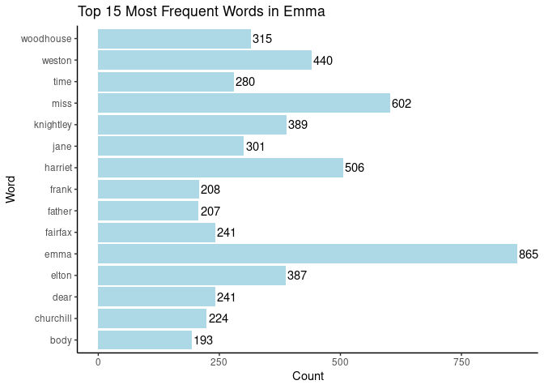

# Assignment B-4

### Shengyu Zuo

### Option A – Strings and functional programming in R: Exercise 1 & 2

------------------------------------------------------------------------

Load the necessary packages:

``` r
library(janeaustenr)
library(tidytext)
library(ggplot2)
library(tidyverse)
```

    ## ── Attaching core tidyverse packages ──────────────────────── tidyverse 2.0.0 ──
    ## ✔ dplyr     1.1.4     ✔ readr     2.1.4
    ## ✔ forcats   1.0.0     ✔ stringr   1.5.1
    ## ✔ lubridate 1.9.3     ✔ tibble    3.2.1
    ## ✔ purrr     1.0.2     ✔ tidyr     1.3.0
    ## ── Conflicts ────────────────────────────────────────── tidyverse_conflicts() ──
    ## ✖ dplyr::filter() masks stats::filter()
    ## ✖ dplyr::lag()    masks stats::lag()
    ## ℹ Use the conflicted package (<http://conflicted.r-lib.org/>) to force all conflicts to become errors

``` r
library(testthat)
```

    ## 
    ## Attaching package: 'testthat'
    ## 
    ## The following object is masked from 'package:dplyr':
    ## 
    ##     matches
    ## 
    ## The following object is masked from 'package:purrr':
    ## 
    ##     is_null
    ## 
    ## The following objects are masked from 'package:readr':
    ## 
    ##     edition_get, local_edition
    ## 
    ## The following object is masked from 'package:tidyr':
    ## 
    ##     matches

**Ex1:**

  
*Take a Jane Austen book contained in the `janeaustenr` package, or
another book from some other source, such as one of the many freely
available books from [Project Gutenberg](https://dev.gutenberg.org/) (be
sure to indicate where you got the book from). Make a plot of the most
common words in the book, removing “stop words” of your choosing (words
like “the”, “a”, etc.) or stopwords from a pre-defined source, like the
`stopwords` package or `tidytext::stop_words`.*

*If you use any resources for helping you remove stopwords, or some
other resource besides the `janeaustenr` R package for accessing your
book, please indicate the source. We aren’t requiring any formal
citation styles, just make sure you name the source and link to it.*

**Solution:**

The code is a text processing routine designed for Jane Austen’s “Emma”.
Initially, it assembles a list of stopwords, from the pre-defined
tidytext::stop_words. Next, the code dissects the entirety of “Emma”
into its fundamental components: individual words in lowered case,
punctuation marks, and whitespace characters. Following this, it
discards the stopwords obtained earlier and refines the collection to
isolate solely the words. Finally, the code conducts a tibble of word
frequencies and arranges these words in descending order based on their
frequency. More details shown in code comments.

``` r
stopwords <- tidytext::stop_words %>% 
  select(word) # select only the useful column
head(stopwords)
```

    ## # A tibble: 6 × 1
    ##   word     
    ##   <chr>    
    ## 1 a        
    ## 2 a's      
    ## 3 able     
    ## 4 about    
    ## 5 above    
    ## 6 according

``` r
book <- janeaustenr::emma %>% # load the book Emma
  str_split("\\s+|(?=\\p{P})|(?<=\\p{P})") %>% # separate the words, punctuations, and whitespace characters e.g. space, tab, newline
  unlist() %>% # unlist the string to make a tibble containing single characters
  tolower() %>% # discard case sensitivity
  tibble(word = .) %>% # create the tibble and name the column as 'word'
  anti_join(stopwords, by = join_by(word)) %>% # use anti_join to remove the stop words
  filter(str_detect(word,"\\S") & !str_detect(word,"\\p{P}")) %>% # remove the punctuations and whitespace characters from the tibble
  count(word = word, sort = TRUE) # word frequency count and sort
head(book,15)
```

    ## # A tibble: 15 × 2
    ##    word          n
    ##    <chr>     <int>
    ##  1 emma        865
    ##  2 miss        602
    ##  3 harriet     506
    ##  4 weston      440
    ##  5 knightley   389
    ##  6 elton       387
    ##  7 woodhouse   315
    ##  8 jane        301
    ##  9 time        280
    ## 10 dear        241
    ## 11 fairfax     241
    ## 12 churchill   224
    ## 13 frank       208
    ## 14 father      207
    ## 15 body        193

The following code plots the Top 15 most common words in the book
‘Emma’. The words are in lower case for better coverage.

``` r
plot <- ggplot(book[1:15, ], aes(x = n, y = word)) + 
  geom_bar(stat = 'identity', fill = 'lightblue') +
      geom_text(aes(label = n), vjust = 0.5, hjust = -0.1) + # add numbers to each bar
      theme_classic()+
      labs(x = "Count", y = "Word") +
      ggtitle('Top 15 Most Frequent Words in Emma')
plot
```

<!-- -->

------------------------------------------------------------------------

**Ex2:**

  
*Make a function that converts words to your own version of Pig Latin.*

*The specific input and output that you decide upon is up to you. Don’t
forget to implement good function-making hygiene: we’ll be looking for
(unrendered) roxygen2-style documentation (being sure to describe your
Pig Latin conversion), examples of applying the function, 3
non-redundant tests, appropriate use of arguments, and appropriate
amount of checking for proper input.*

**Solution:**

This version of Pig Latin is a transformation of any words into names
reminiscent of the Cthulhu Mythos inspired by the works of H.P.
Lovecraft. Here are some famous Lovecraftian names: C’thulhu,
Shub-Niggurath, C’thalpa, and Yog-Sothoth.

The process involves reversing the word at first, then based on specific
rules:

For words without duplicated letters: duplicate the first vowel (if
any), place ’ ’ ’ after the first consonant, and append ‘en’ to the
word.

- “tom” = “M’ooten”

- “mario” = “Ooir’amen”

- “fly” (without vowels) = “Y’lfen”

For words with duplicated letters: insert ’ - ’ between the first pair
of duplicated letters and add ‘ah’ to the end of the word.

- “apple” = “Elp-Paah”

- “ellen” = “Nel-Leah”

- “goddess” = “S-Seddogah”

The above transformation also includes capitalizing the first letter.

The input could be any letter (not word) combinations, case-insensitive,
but without symbols or whitespace characters. If the input is blank, the
function will return a name from a randomly generated five letter
combination.

``` r
#' Lovecraftian Pig Latin
#'
#' @description Given a <chr> data `name`, `lovecraft()` creates
#' a Lovecraftian name based on the input.
#'
#' @details This function is
#' an implementation of Pig Latin using functions in the `stringr` package.
#'
#' @param name a blank or <chr> data that could be any letter combinations, 
#' case-insensitive, but without symbols or whitespace characters. 
#' 
#' @examples
#' library(stringr)
#' lovecraft('Candy')
#' lovecraft('bella')
#' lovecraft('')
#'
#' @return A lovecraftian name in <chr> format.
#' 
#' @importFrom stringr
#' 
#' @export
#' 
lovecraft <- function(name) {
  
  ## input 
  
  # detect if the input is letters only
  if (str_detect(name, "[^A-Za-z]")) {
    stop('Input should be letters only!')
  } 
  else {
  
  # if input is blank, generate a random 5 letter combination
  if (name == ''){
    letters = sample(letters, 5, replace = TRUE)
    name = paste(letters, collapse = "")
  }
  
  ## main body
  
  # reverse the input by splitting and reordering
  reverse = paste(str_split(name,'')[[1]][str_length(name):1],collapse = "")
  
  # find the index of duplicated letters (if any)
  indexd = str_locate(reverse, '(.)\\1')[1]
  
  # if there are duplicated letters, add a '-' in between, and add 'ah' at the end
  if(!is.na(indexd)){
    add = str_c(str_sub(reverse, 1, indexd),'-', str_sub(reverse, indexd+1))
    add_end = str_c(add,'ah')
  }
  
  # if there aren't duplicated letters, duplicate the first vowel (if any), insert a ''' after the first consonant, and add 'en' at the end
  else{
    duplicate = str_replace(reverse, "([aeiou])", "\\1\\1")
    index = str_locate(duplicate, "[^aeiou]")[1]
    add = str_c(str_sub(duplicate, 1, index),'\'', str_sub(duplicate, index+1))
    add_end = str_c(add,'en')
  }
  
  # capitalize the first letter & letter after '-'
  result = str_to_title(add_end)
  
  
  ##return
  return(result)
  }
}
```

**Examples:**

1.  If the input contains symbols there will be an error message.

``` r
lovecraft('hello world!')
```

    ## Error in lovecraft("hello world!"): Input should be letters only!

2.  Input name is ‘bella’. Output name is ‘Al-Lebah’.

``` r
lovecraft('bella')
```

    ## [1] "Al-Lebah"

3.  Input is blank. Output is randomly generated.

``` r
lovecraft('')
```

    ## [1] "G'oonvien"

**Tests:**

1.  Test if output is correctly transformed; test if output format is
    <chr>.

``` r
test_that("Test 1: Normal letter input", {
  
  # create a random input
  name = 'abcddeeff'
  
  # apply the function
  result <- lovecraft(name)

  # test if output is correctly transformed; test if output format is <chr>
  expect_match('F-Feeddcbaah', result)
  expect_type(result, 'character')
  
})
```

    ## Test passed 🎊

2.  Test if error occurs when input contains symbols.

``` r
test_that("Test 2: Input containing symbols", {
  
  # create a random input with symbols
  name = 'a!b c.d'
  
  # test if error occurs
  expect_error(lovecraft(name))
  
})
```

    ## Test passed 🥇

3.  Test if a blank input can generate a random output.

``` r
test_that("Test 3: Blank Input", {
  
  # create a blank input
  name = ''
  
  # apply the function
  result <- lovecraft(name)
  
  # test if the output contains ''' or '-' since a valid output must include one of them
  expect_true(any(str_detect(result, "'")) || any(str_detect(result, "-")))
  
})
```

    ## Test passed 😸

4.  Test if other type of input will result in an error.

``` r
test_that("Test 4: Input of other types", {
  
  # create a random input in list format
  name = c('apple','banana')
  
  # test if error occurs
  expect_error(lovecraft(name))
  
})
```

    ## Test passed 🌈
